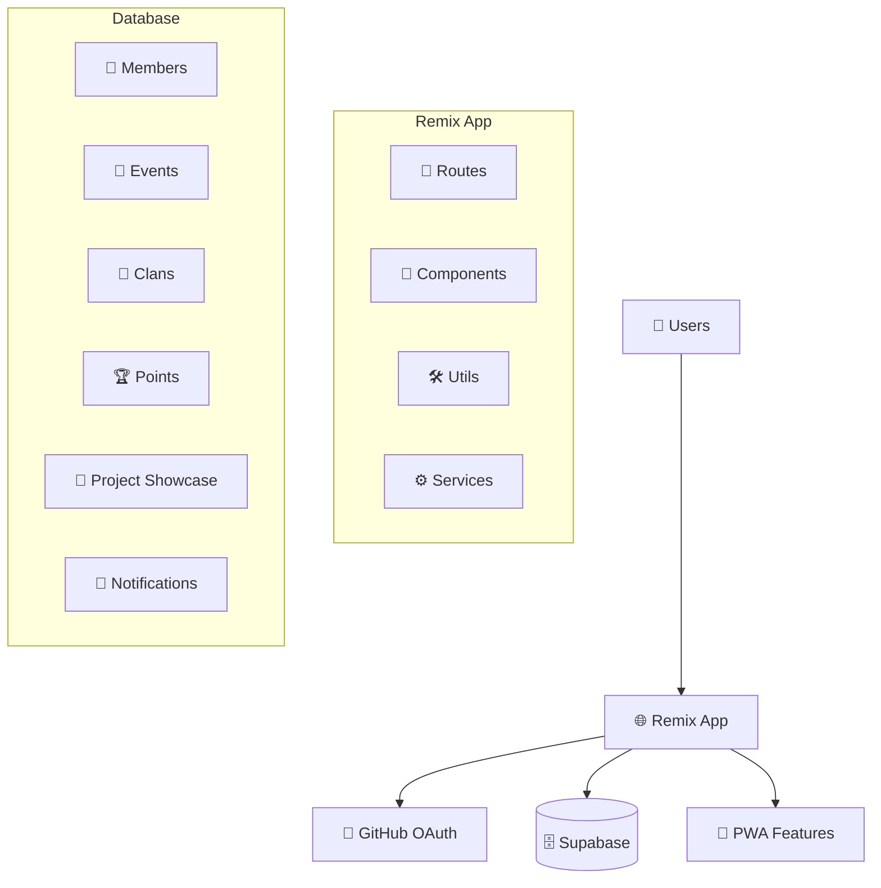
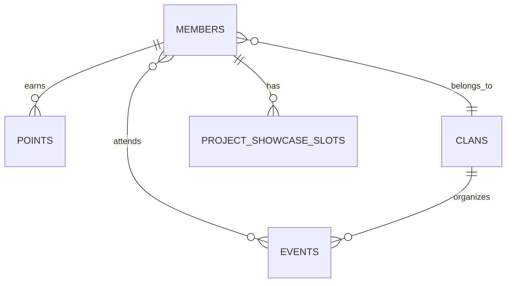

# 🏗️ Architecture Overview

## 📋 **System Architecture**

ByteBashBlitz Terminal is a full-stack web application built with modern technologies to provide a scalable, maintainable community platform.

### **High-Level Architecture**



## 🛠️ **Tech Stack**

### **Frontend**
- **Framework**: Remix v2 with TypeScript
- **Styling**: Tailwind CSS + Radix UI
- **Animations**: Framer Motion
- **State Management**: React hooks + Remix loaders
- **Icons**: Lucide React

### **Backend**
- **Runtime**: Node.js 20+
- **Framework**: Remix (full-stack)
- **Database**: Supabase (PostgreSQL)
- **Authentication**: GitHub OAuth via Remix Auth
- **Real-time**: Supabase Realtime

### **Infrastructure**
- **Hosting**: Render
- **Database**: Supabase Cloud
- **CDN**: Built-in with Render
- **Monitoring**: Built-in Render metrics

## 📁 **Project Structure**

```
remix-leaderboard/
├── app/                          # Main application code
│   ├── components/               # React components
│   │   ├── ui/                  # Base UI components (Radix)
│   │   ├── events/              # Event-related components
│   │   ├── leaderboard/         # Leaderboard components
│   │   ├── project-showcase/    # Project showcase components
│   │   └── *.tsx                # Other reusable components
│   ├── routes/                  # Remix routes (pages + API)
│   │   ├── api.*.ts            # API endpoints
│   │   ├── _index.tsx          # Home page
│   │   ├── _protected.tsx      # Protected route wrapper
│   │   └── *.tsx               # Other pages
│   ├── services/                # External integrations
│   │   ├── github.server.ts    # GitHub API
│   │   ├── leetcode.server.ts  # LeetCode API
│   │   └── *.server.ts         # Other services
│   ├── utils/                   # Utility functions
│   │   ├── supabase.server.ts  # Server-side Supabase
│   │   ├── supabase.client.ts  # Client-side Supabase
│   │   └── *.ts                # Other utilities
│   ├── types/                   # TypeScript definitions
│   ├── hooks/                   # Custom React hooks
│   ├── contexts/                # React contexts
│   └── styles/                  # Global styles
├── supabase/                    # Database-related files
│   └── migrations/              # SQL migration files
├── public/                      # Static assets
├── scripts/                     # Utility scripts
├── docs/                        # Documentation
└── build/                       # Build output (generated)
```

## 🗄️ **Database Schema**

### **Core Tables**

#### **members**
```sql
- id: Primary key
- github_username: Unique GitHub username
- name: Display name
- email: Contact email
- bash_points: Total points earned
- title: Member tier/role
- clan_name: Associated clan
- avatar_url: Profile picture
- created_at, updated_at: Timestamps
```

#### **events**
```sql
- id: Primary key
- title: Event name
- description: Event details
- date, time: When event occurs
- venue: Location
- leading_clan: Organizing clan
- attendees: Number of participants
- status: upcoming/ongoing/completed
- created_at, updated_at: Timestamps
```

#### **clans**
```sql
- id: Primary key
- clan_name: Unique clan name
- description: Clan description
- members: Array of member IDs
- clan_score: Total clan points
- activities: Recent activities
- created_at, updated_at: Timestamps
```

#### **points**
```sql
- id: Primary key
- member_id: Reference to member
- points: Points awarded (can be negative)
- description: Reason for points
- created_at: When points were awarded
```

#### **project_showcase_slots**
```sql
- id: Primary key
- member_id: Reference to member
- slot_number: Presentation slot (1-25)
- event_id: Associated event
- status: allocated/confirmed/cancelled
- allocated_at: When slot was assigned
```

### **Relationships**



## 🔄 **Data Flow**

### **Authentication Flow**
1. User clicks "Login with GitHub"
2. Redirected to GitHub OAuth
3. GitHub redirects back with code
4. Server exchanges code for user data
5. User session created
6. User redirected to dashboard

### **Point System Flow**
1. Organizer awards points via admin panel
2. Points record created in database
3. Member's total points updated
4. Leaderboard automatically refreshed
5. Tier progression checked
6. Notifications sent if applicable

### **Event Participation Flow**
1. User views events list
2. Clicks "Join Event"
3. Attendance count incremented
4. User added to participants list
5. Confirmation notification sent
6. Event appears on user dashboard

## 🔐 **Security Architecture**

### **Authentication**
- GitHub OAuth for user identity
- JWT sessions managed by Remix Auth
- No passwords stored locally

### **Authorization**
- Role-based access control
- Organizer permissions for admin actions
- Row Level Security (RLS) in Supabase

### **Data Protection**
- All user inputs validated
- SQL injection prevention via Supabase client
- XSS protection via React's built-in sanitization
- CSRF protection via SameSite cookies

## 📱 **PWA Architecture**

### **Service Worker**
- Caches static assets
- Offline page fallback
- Background sync for notifications

### **Manifest**
- App installation prompts
- Custom app icons
- Splash screens
- Theme colors

## 🔄 **State Management**

### **Server State**
- Remix loaders for initial data
- Remix actions for mutations
- Supabase real-time subscriptions

### **Client State**
- React hooks for local state
- React Context for global state
- Minimal client-side state

### **Caching Strategy**
- Browser cache for static assets
- Supabase cache for database queries
- Service worker cache for offline support

## 🚀 **Performance Optimizations**

### **Frontend**
- Code splitting via Remix
- Lazy loading of heavy components
- Image optimization
- CSS purging via Tailwind

### **Backend**
- Database query optimization
- Proper indexing
- Connection pooling
- Caching frequently accessed data

### **Network**
- CDN for static assets
- Gzip compression
- HTTP/2 support
- Optimized bundle sizes

## 📊 **Monitoring & Analytics**

### **Application Monitoring**
- Render built-in metrics
- Error tracking via console
- Performance monitoring

### **Database Monitoring**
- Supabase dashboard metrics
- Query performance analysis
- Connection monitoring

## 🔮 **Scalability Considerations**

### **Horizontal Scaling**
- Stateless application design
- Database connection pooling
- CDN for static content

### **Vertical Scaling**
- Optimized database queries
- Efficient component rendering
- Memory usage optimization

### **Future Enhancements**
- Redis for session storage
- ElasticSearch for advanced search
- Microservices architecture
- GraphQL API layer

## 🛡️ **Error Handling**

### **Client-Side**
- React Error Boundaries
- Toast notifications for user feedback
- Graceful degradation for missing features

### **Server-Side**
- Try-catch blocks for all async operations
- Proper HTTP status codes
- Detailed error logging

### **Database**
- Transaction rollbacks on errors
- Constraint validation
- Backup and recovery procedures

---

This architecture supports the current feature set while providing flexibility for future enhancements and scaling as the community grows.
